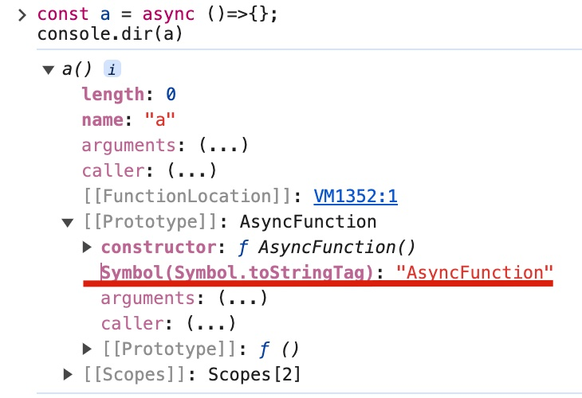

# 如何判断异步函数

* 如图，打印出的函数的原型为 AsyncFunction，说明该函数是一个异步函数。
* 上面有一个 Symbol.toStringTag 属性，它的属性值为 AsyncFunction。
* 如何访问 Symbol.toStringTag 属性呢？
  *  `Object.prototype.toString()`
     *  参考[ob 笔记](obsidian://advanced-uri?vault=shen&filepath=code%252FJS%252Fapi%252FObject.md)

> 参考视频：[链接](https://v.douyin.com/iLcrBc3U/)
